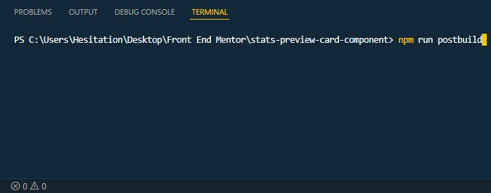

# Frontend Mentor - 3-column preview card component solution

This is a solution to the [3-column preview card component challenge on Frontend Mentor](https://www.frontendmentor.io/challenges/3column-preview-card-component-pH92eAR2-). Frontend Mentor challenges help you improve your coding skills by building realistic projects. 

The root directory here displays the final compiled output, to use the source files for its SASS functions, use the ```source``` folder as your root directory and requires the setup below.

## Setup

Using this requires that you install [Nodejs](https://nodejs.org/en/) to run node packet manager in the command line, if you don't have it yet download from the link above and install it. 

After that, you can now initialize the project using the command line or the build-in VScode command line using ```ctrl + ` ``` then running the ```npm install``` command. 

Then run the ```npm start``` command to start development.  

If you are finished with the project, you can also use the ```npm run postbuild``` script to have your css be run through autoprefixer for browser compatibility and minify it at the same time. 

## Table of contents

- [Overview](#overview)
  - [The challenge](#the-challenge)
  - [Screenshot](#screenshot)
  - [Links](#links)
- [My process](#my-process)
  - [Built with](#built-with)
  - [What I learned](#what-i-learned)
- [Author](#author)

## Overview

### The challenge

Users should be able to:

- View the optimal layout depending on their device's screen size
- See hover states for interactive elements

### Screenshot

|  |  |  |
| ------- | ------- | ------- |
| Mobile  | Desktop | Active  |

### Links

- Solution URL: [Github Repo](https://github.com/Negligence/3-column-preview-card-component)
- Live Site URL: [Github Pages](https://negligence.github.io/3-column-preview-card-component/)

## My process

### Built with

- Semantic HTML5 markup
- SASS
- [Nodejs](https://nodejs.org/en/)
- Semantic HTML5 markup
- CSS custom properties
- CSS Grid
- Mobile-first workflow

### What I learned

I had a little bit of trouble with the Accessibility and HTML Validator because of my HTML Markup.

```html
  <main>

    <section>
      <h1>3 Column Preview Card Component</h1>
      <article>
        
        <h2>SEDANS</h2>
        <p>Choose a sedan for its affordability and excellent fuel economy. Ideal for cruisinng in the city or on your next road trip.</p>
        <a href="#">Learn More</a>
      </article>
      
      <article>
        
        <h2>SUVS</h2>
        <p>Take an SUV for its spacious interior, power, and versatility. Perfect for your next family vacation and off-road adventures.</p>
        <a href="#">Learn More</a>
      </article>
      
      <article>
        
        <h2>LUXURY</h2>
        <p>Cruise in the best car brands without the bloated prices. Enjoy the enhanced comfort of a luxury  rental and arrive in style.</p>
        <a href="#">Learn More</a>
      </article>
    </section>

  </main>
  
  <footer class="attribution">
    Challenge by <a href="https://www.frontendmentor.io/challenges/3column-preview-card-component-pH92eAR2-" target="_blank">Frontend Mentor</a>. 
    Coded by <a href="https://www.frontendmentor.io/profile/Negligence" target="_blank">Jan</a>.
  </footer>
```

So I applied an `opacity:0` to my `<h1>` and set it to `position:fixed` and sent it back with `z-index:-1`.
I've also added a `text-decoration:underline` to my footer links because there were warnings for some reason.
```scss
section {
  overflow: hidden;
  border-radius: rem(8px);

  > h1 {
    opacity: 0;
    position: fixed;
    z-index: -1;
  }

  ... {
    // Omitted Code
  }
}

footer > a {
  text-decoration: underline;

  ...{
    // Omitted Code
  }
}
```

## Author

- Frontend Mentor - [@Negligence](https://www.frontendmentor.io/profile/Negligence)
- Github - [Negligence](https://github.com/Negligence)
- Twitter - [@IEImNothing](https://twitter.com/IEImNothing)
- Twitch - [Arrogant_Negligence](https://www.twitch.tv/arrogant_negligence)
- Youtube - [Jan Panado](https://www.youtube.com/channel/UC4ojhHYmkHptu2JpyKtrL-w)
- LinkedIn - [Jan Panado](https://www.linkedin.com/in/janp-09/)
- Facebook - [Jan Panado](https://www.facebook.com/jan.panado)
- Website - [Jan Panado](https://janpanado.com/)